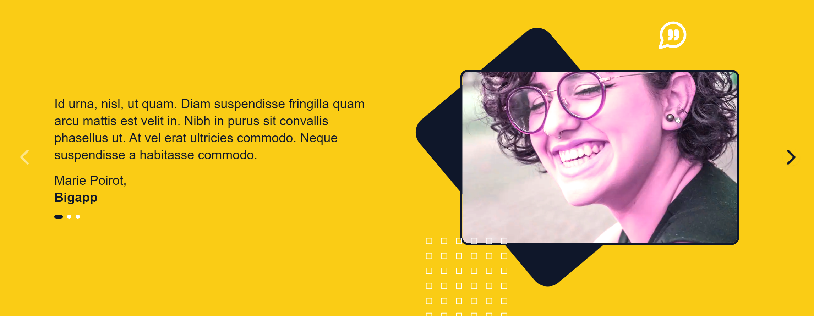

## 📌Teach

This project is a **Single Page Application (SPA)** developed on the basis of a prototype created in **Figma**, with the aim of being built in **7 days**.

---
## 🧱 Stack

This project was developed using the following technologies:

- **Next.js** - React framework for full-stack applications
- **TypeScript** - Static typing for greater reliability and productivity
- **Tailwind CSS** - Modern CSS utility for fast and responsive styling
- **Lucide React** - Icon library in React
- **Next-Intl** - Internationalisation of Next.js applications with namespace and SSR support
- **ESLint** - Code standardisation with linting and formatting

---
## 📝 General Considerations about the Project

### 🌐 Internationalisation (i18n)

The project follows a simplified translation model, suited to its scope. The entire translation structure is centralised in a **single translation page**, called `default`, which avoids the need to specify the namespace in each call.

#### File Structure

- The file `en.ts` contains the Portuguese translations.
- The file `en.ts` is a **copy of `en.ts`**, but with the keys as values, because the texts are originally in English.
- When a text is just a mock, it has been marked with a [PT-BR] tag to indicate that there has been a translation, even if the final content is not yet defined.


Example of a customised `en.ts` entry, especially for large texts:
```ts
'teach-students-worldwide-description': 'Amet nunc diam orci duis ut sit diam arcu, nec. ' +
  'Eleifend proin massa tincidunt viverra lectus pulvinar. ' +
  'Nunc ipsum est pellentesque turpis ultricies. em',
````

#### Hook and Wrapper

The `useTranslations` (or `getTranslations`) function is wrapped in a wrapper (`translation.ts`) that already assumes the `default` namespace by default, allowing the direct use of keys:

```ts
const t = useTranslations();
t('some.key'); // Equivale a t('default.some.key')
```

This approach can be easily adapted to multiple namespaces if necessary in future projects.

#### Statements and Static Texts

Some cards appear to contain **statements or texts that would normally come from an external source**. As the project does not have a back-end, it was decided to apply translation to these texts as well, even though in a real project this decision would need to be evaluated according to the scope - they could be treated as external content without translation.

---

### 🎨 Design and Icons

#### Visual Changes to Icons

The **Lucide React** package is used for the icons, as it is open-source, which has led to **small divergences from the prototype**. A clear example is the accessibility icon:


**Prototype:** "stand" icon (T-shaped position).
**Lucide:** icon with a more open body (star shape).

This difference was considered **acceptable within the current scope**, but in a real project it would be discussed with the design team.

#### Decorative Icons and Position

Some of the prototype's decorative icons appear as **static elements in the background**, simulating texture and volumetry. In the project, it was decided to use **animations and random distribution**, creating an idea of floating particles with movement, maintaining the general concept but not the exact position.

This was a **conscious decision** and **conducive to the scope**, but it is emphasised that, in a professional environment, the proposal would be discussed with design to align expectations.

---

### 🌍 Language Switching in the Footer

In the project, the **language switcher** is located in the **footer**, displaying an icon and the acronym of the current language (e.g. `EN`, `PT`). When clicked, the language is switched.

* The icon **shows the current language**, not the target language when you click.
* This decision was made on the basis of simplicity and visual clarity.

#### 💡 Suggestion for Production

In a real project, it would be interesting to discuss with design the possibility of:

* Position the language switcher in the **header** (more visible).
* Use **flags** next to the acronym, making navigation more intuitive.

In the current scope, this suggestion has only been registered as an observation, faithfully following the prototype.

---

## 🎠 Considerations about the Carousel in Section Three

In the design prototype (Section Three), the presence of a carousel was indicated. However, one of the graphic shapes on the banner exceeded the limits of the carousel itself, which in real implementations would cause this content to be cut off - since carousels, by default, hide everything that exceeds their visual limits.

In view of this, a decision had to be made between:

- Keeping a static image faithful to the design, but with no real carousel feature, **or**
- Implementing the functional carousel, with adjustments to the sizes and positioning of the visual elements to maintain the **aesthetic cohesion** with the prototype.

The **second approach** was chosen, prioritising the interactive feature of the carousel. To do this, subtle adjustments were made to the shapes and proportions of the elements, ensuring that everything remained within visual limits without compromising the overall harmony proposed by the original design.

> Note: **It would have been technically feasible to implement a customised solution that combined both approaches - with elements visually going beyond the limits of the carousel - but, considering the project's short delivery time, this option was discarded in favour of a more direct and functional solution**.




