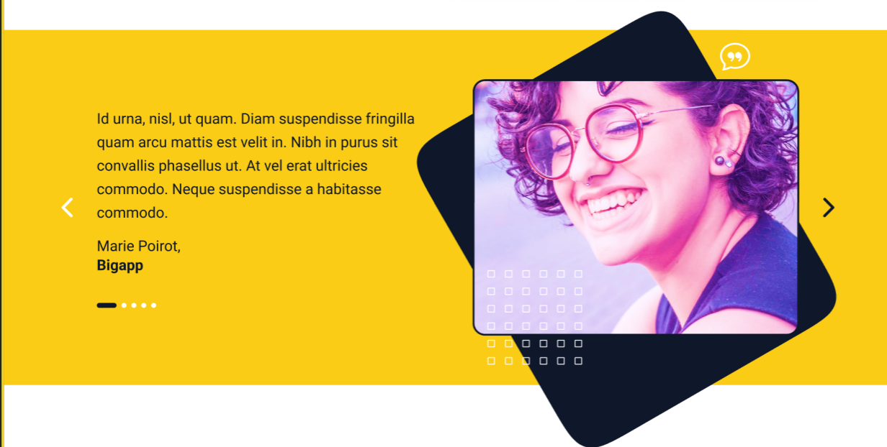

## 📌Teach

Este projeto é uma **Single Page Application (SPA)** desenvolvida com base em um protótipo criado no **Figma**, com o objetivo de ser construída em **7 dias**.

---
## 🧱 Stack Utilizada

Este projeto foi desenvolvido utilizando as seguintes tecnologias:

- **Next.js** – Framework React para aplicações full-stack
- **TypeScript** – Tipagem estática para maior confiabilidade e produtividade
- **Tailwind CSS** – Utilitário CSS moderno para estilização rápida e responsiva
- **Lucide React** – Biblioteca de ícones em React
- **Next-Intl** – Internacionalização de aplicações Next.js com suporte a namespaces e SSR
- **ESLint** – Padronização de código com linting e formatação

---
## 📝 Considerações Gerais sobre o Projeto

### 🌐 Internacionalização (i18n)

O projeto segue um modelo simplificado de tradução, adequado ao seu escopo. Toda a estrutura de tradução está centralizada em uma **única página de tradução**, chamada `default`, o que evita a necessidade de especificar a namespace em cada chamada.

#### Estrutura dos Arquivos

- O arquivo `pt.ts` contém as traduções em português.
- O arquivo `en.ts` é uma **cópia de `pt.ts`**, mas com as chaves como valores, pois os textos estão originalmente em inglês.
- Quando um texto é apenas um mock, ele foi marcado com uma tag [PT-BR] para indicar que houve uma tradução, mesmo que o conteúdo final ainda não esteja definido.


Exemplo de entrada em `en.ts` customizada, principalmente para textos grandes:
```ts
'teach-students-worldwide-description': 'Amet nunc diam orci duis ut sit diam arcu, nec. ' +
  'Eleifend proin massa tincidunt viverra lectus pulvinar. ' +
  'Nunc ipsum est pellentesque turpis ultricies. em',
````

#### Hook e Wrapper

A função `useTranslations` (ou `getTranslations`) está envolta em um wrapper (`translation.ts`) que já assume a namespace `default` como padrão, permitindo o uso direto de chaves:

```ts
const t = useTranslations();
t('some.key'); // Equivale a t('default.some.key')
```

Essa abordagem pode ser facilmente adaptada para múltiplas namespaces, se necessário em projetos futuros.

#### Depoimentos e Textos Estáticos

Alguns cards aparentam conter **depoimentos ou textos que normalmente viriam de uma fonte externa**. Como o projeto não possui back-end, optou-se por aplicar a tradução também nesses textos, mesmo que em um projeto real essa decisão precisaria ser avaliada conforme o escopo — podendo ser tratados como conteúdo externo sem tradução.

---

### 🎨 Design e Ícones

#### Alterações Visuais em Ícones

Utiliza-se o pacote **Lucide React** para os ícones, por ser open-source, o que gerou **pequenas divergências em relação ao protótipo**. Um exemplo claro é o ícone de acessibilidade:


* **Protótipo:** ícone "stand" (posição em T).
* **Lucide:** ícone com o corpo mais aberto (formato de estrela).

Essa diferença foi considerada **aceitável dentro do escopo atual**, mas em um projeto real seria discutido com a equipe de design.

#### Ícones Decorativos e Posição

Alguns ícones decorativos do protótipo aparecem como elementos **estáticos no fundo**, simulando textura e volumetria. No projeto, optou-se por usar **animações e distribuição aleatória**, criando uma ideia de partículas flutuantes com movimento, mantendo o conceito geral mas não a posição exata.

Essa foi uma **decisão consciente** e **condizente com o escopo**, mas reforça-se que, em um ambiente profissional, a proposta seria discutida com design para alinhar expectativas.

---

### 🌍 Troca de Idioma no Footer

No projeto, a **troca de idioma** está localizada no **footer**, exibindo um ícone e a sigla do idioma atual (por exemplo, `EN`, `PT`). Ao clicar, o idioma é alternado.

* O ícone **mostra o idioma atual**, e não o idioma de destino ao clicar.
* Essa decisão foi feita com base na simplicidade e clareza visual.

#### 💡 Sugestão para Produção

Em um projeto real, seria interessante discutir com design a possibilidade de:

* Posicionar o botão de troca de idioma no **header** (mais visível).
* Usar **bandeiras** ao lado da sigla, tornando a navegação mais intuitiva.

No escopo atual, essa sugestão foi registrada apenas como observação, seguindo fielmente o protótipo.

---

## 🎠 Considerações sobre o Carrossel da Seção Três

No protótipo de design (Seção Três), foi indicada a presença de um carrossel. No entanto, uma das formas gráficas presentes no banner ultrapassava os limites do próprio carrossel, o que em implementações reais causaria o corte desse conteúdo — já que carrosséis, por padrão, ocultam tudo que excede seus limites visuais.

Diante disso, foi necessário tomar uma decisão entre:

- Manter uma imagem estática fiel ao design, mas sem recurso real de carrossel, **ou**
- Implementar o carrossel funcional, com ajustes nos tamanhos e posicionamentos dos elementos visuais para manter a **coesão estética** com o protótipo.

Optou-se pela **segunda abordagem**, priorizando a recurso interativa do carrossel. Para isso, foram feitas adequações sutis nas formas e proporções dos elementos, garantindo que tudo se mantivesse dentro dos limites visuais sem comprometer a harmonia geral proposta pelo design original.

> **Nota:** Seria tecnicamente viável implementar uma solução customizada que unisse ambas as abordagens — com elementos ultrapassando visualmente os limites do carrossel — mas, considerando o prazo reduzido de entrega do projeto, essa opção foi descartada em favor de uma solução mais direta e funcional.




